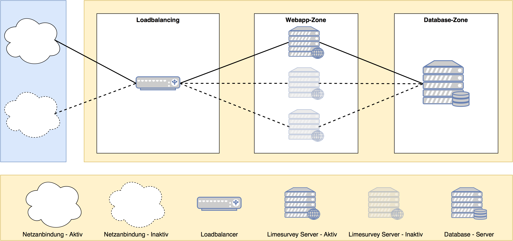

# Feature Name

Author: Jan Stodt, Axel Butz

## Introduction

Vorgeschlagene System Architektur um Limesurvey skalierbar
zu deployen.

## Motivation

Durch diese System Architektur lässt sich Limesurvey
skalierbar und preiswert zu deployen.

## Proposed solution

## Limits of this solution

Der einzelne Loadbalancer und die einzenle Datenbank
stellt in der aktuellen Konzeption keine HA Verfügbarkeit
bereit. Diese Design Entscheidung wurde aufgrund des
unbekannten Kostenrahmens gewählt.
Die mehrfache Auslegung wurde auf den Webserver beschränkt,
dort ist Skalierbarkeit am wichtigsten.